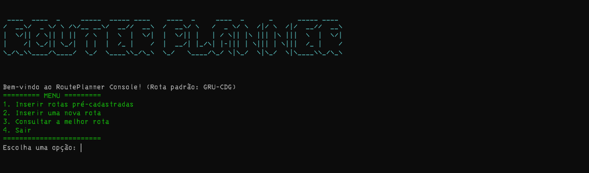

# RoutePlanner Project

## Descrição Geral
Este projeto implementa uma aplicação para calcular as melhores rotas entre dois pontos, permitindo a inserção de novas rotas e a consulta de rotas cadastradas. O sistema foi desenvolvido utilizando .NET C# com foco em boas práticas de desenvolvimento e testes unitários.

## Como Executar a Aplicação

### Pré-requisitos
- **SDK do .NET 9.0** ou superior instalado.
- Banco de dados SQLite (gerado automaticamente pela aplicação).
- Um editor de código,  **Visual Studio Code** (opcional).

### Execução da API
1. Acesse o diretório do projeto API:
   ```bash
   cd src/RoutePlanner.API
   ```
2. Execute o comando para iniciar a API:
   ```bash
   dotnet run
   ```
3. A API estará disponível em `http://localhost:5102`.

### Execução do Console
1. Acesse o diretório do projeto Console:
   ```bash
   cd src/RoutePlanner.Console
   ```
2. Execute o comando para iniciar a aplicação:
   ```bash
   dotnet run
   ```
3. Siga as instruções exibidas no menu da aplicação.

### Execução dos Testes
1. Acesse o diretório de testes:
   ```bash
   cd tests/RoutePlanner.Tests
   ```
2. Execute todos os testes:
   ```bash
   dotnet test
   ```

## Estrutura do Projeto

### Estrutura de Pastas
```
├── src
│   ├── RoutePlanner.API
│   │   ├── Controllers
│   │   ├── Configuration
│   │   ├── Middleware
│   │   ├── Migrations
│   │   ├── Data
│   │   ├── Models
│   │   ├── Repositories
│   │   ├── Services
│   │   └── Program.cs
│   ├── RoutePlanner.ConsoleApp
│   │   └── Program.cs
│   ├── RoutePlanner.Domain
│   │   ├── Interfaces
│   │   └── Entities
├── tests
│   ├── RoutePlanner.Tests
│   │   ├── UnitTests
│   │   │   ├── Repositories
│   │   │   ├── Services
│   │   ├── IntegrationTests
├── README.md
```

### Explicação das Pastas
- **RoutePlanner.API**: Contém a API principal.
  - **Controllers**: Define os endpoints expostos pela API.
  - **Data**: Configuração do banco de dados e contexto (utilizando SQLite).
  - **Models**: Define os modelos de entrada e saída da aplicação.
  - **Repositories**: Implementação de acesso a dados.
  - **Services**: Contém a lógica de negócios.
- **RoutePlanner.Console**: Contém a aplicação de interface em linha de comando.
- **RoutePlanner.Tests**: Contém os testes unitários e de integração.
  - **UnitTests**: Testes que validam funcionalidades isoladas (serviços e repositórios).
  - **IntegrationTests**: Testes que validam a interação entre componentes (ex.: API).

## Decisões de Design

### 1. **Estrutura Modular**
O projeto foi estruturado de forma modular, separando as responsabilidades entre camadas distintas (Controllers, Services, Repositories, etc.) para facilitar a manutenção e escalabilidade.

### 2. **Uso de SQLite**
A escolha pelo SQLite permite que o banco de dados seja criado e gerenciado automaticamente na pasta `Data` da aplicação, simplificando o ambiente de execução.

### 3. **Testes Unitários e de Integração**
Foram implementados testes unitários e de integração utilizando boas práticas, como a criação de um banco de dados em memória para garantir isolamento e independência dos testes.

### 4. **Boas Práticas de Desenvolvimento**
- Utilização de **injeção de dependência** para gerenciar serviços e repositórios.
- **Validação de entrada** rigorosa utilizando anotações `[Required]` e `[Range]` nos modelos.
- Separação de responsabilidades em camadas claras.

---



Para dúvidas ou suporte, entre em contato com o responsável pelo projeto pelo e-mail: marcio_costa@live.com.
